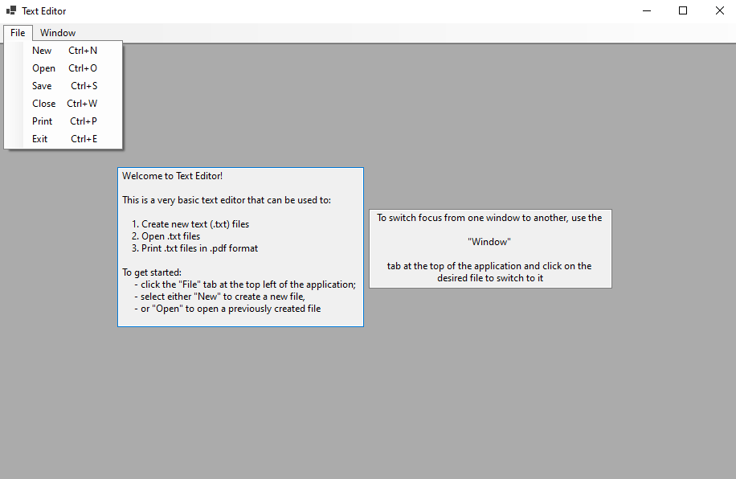

# Text Editor  
## Goal  
 - User Multiple-Documents Interface to create a text editor in WinForms
 - Encourage use of usability principles and how they relate to user interface
## Description  
Using MDI, create a text editor with the following functionality: 

1. New text files can be created and saved;
2. Existing text files can be opened from the file system, changed and saved again;
3. Text editor’s title shows the name of the file that is being edited. For unsaved files, use the title “Untitled”;
4. There is a menu strip at the top containing the following items:
 - File
  - New – Creates a new blank file;
  - Open – Opens an existing file from the file system;
  - Save – Saves the file with a name chosen by the user;
  - Close – Closes the file. If an attempt is made to close an unsaved file, the editor plays a warning sound and asks the user, via a dialog box, if it is ok to close the unsaved file. The user can choose to cancel the close operation or to proceed with closing the unsaved file;
  - Print – Prints the file using the print dialog;
  - Exit – Closes the text editor;
 - Window - Shows the list of files that are currently open. Clicking on an item results in bringing the corresponding file to the front for editing;
5. A status bar at the bottom shows the number of characters in the file. This number changes as more characters are typed in the file;
6. The GUI displays tooltips and provides keyboard shortcuts for some operations to enhance user experience.
7. Enhance your UI to handle multiple text files at the same time. The UI should enable the user via the menu item “Windows” to switch between files that are currently open.

